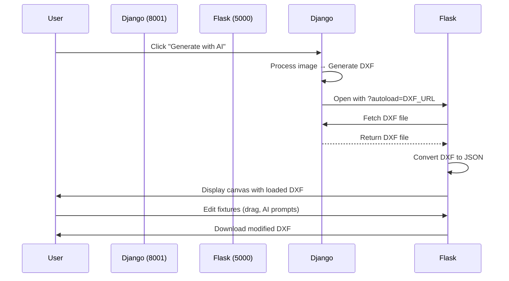

# 🔗 Django Integration - AI_DASHBOARD

## Overview
This branch contains the Django backend integration that enables seamless auto-loading of DXF files generated by the Django application into the AI_DASHBOARD Flask canvas editor.

---

## 🎯 Features Added

### 1. **CORS Support** (`app.py`)
- Added `flask-cors` to allow cross-origin requests from Django (port 8001)
- Enables Flask (port 5000) to receive requests from Django frontend

### 2. **Auto-Load Endpoint** (`app.py`)
```python
@app.route('/upload-from-url', methods=['POST'])
```
- Fetches DXF files from Django media URLs
- Automatically converts and loads into canvas editor
- Handles authentication and file validation

### 3. **URL Parameter Handling** (`templates/index.html`)
- Detects `?autoload=<DXF_URL>` parameter
- Automatically redirects to canvas editor
- Seamless user experience

### 4. **Canvas Auto-Load** (`templates/canvas.html`)
- Fetches DXF from Django backend on page load
- Displays loading status and error messages
- Initializes canvas editor with loaded DXF

---

## 📋 Integration Flow



---

## 🚀 Setup Instructions

### Prerequisites
```bash
# Install required packages
pip install flask flask-cors ezdxf google-generativeai
```

### 1. Start Django Backend
```bash
cd /home/athul/json/lenskart_backend
python3 manage.py runserver 8001
```

### 2. Start Flask AI_DASHBOARD
```bash
cd /home/athul/json/lenskart_backend/AI_DASHBOARD
python3 app.py
```

### 3. Access Applications
- Django Demo: http://127.0.0.1:8001/demo/
- Flask Dashboard: http://127.0.0.1:5000/

---

## 📁 Files Modified

### 1. `app.py`
**Changes:**
- Added `CORS(app)` for cross-origin support
- Added `/upload-from-url` endpoint
- Added URL-based DXF file fetching

### 2. `templates/index.html`
**Changes:**
- Added URL parameter detection script
- Auto-redirect to canvas with autoload parameter

### 3. `templates/canvas.html`
**Changes:**
- Added `autoLoadDXFFromUrl()` function
- Added URL parameter parsing on page load
- Added fetch and display logic for Django DXF files

---

## 🔧 Configuration

### Django Settings (Required)
Ensure Django `demo.html` has the correct Flask URL:
```javascript
const aiAppUrl = 'http://localhost:5000';
if (generatedDxfPath) {
  const fullPath = window.location.origin + generatedDxfPath;
  aiAppUrl += '?autoload=' + encodeURIComponent(fullPath);
}
window.open(aiAppUrl, '_blank');
```

### Flask Gemini API Key
Update in `app.py`:
```python
GEMINI_API_KEY = "YOUR_API_KEY_HERE"
```

---

## 🧪 Testing

### Test Auto-Load Feature:
1. Open Django demo: http://127.0.0.1:8001/demo/
2. Select a project with an image file
3. Click "Generate with AI" button
4. Django processes and generates DXF
5. Flask opens automatically with DXF loaded
6. Verify fixtures appear on canvas

### Manual Test:
```bash
# Open Flask with test DXF URL
http://localhost:5000/?autoload=http://127.0.0.1:8001/media/project_files/2025/10/30/test.dxf
```

---

## 📊 API Endpoints

### Flask AI_DASHBOARD

#### `POST /upload-from-url`
Fetches and loads DXF from Django URL

**Request:**
```json
{
  "dxf_url": "http://127.0.0.1:8001/media/project_files/2025/10/30/file.dxf"
}
```

**Response:**
```json
{
  "session_id": "uuid-here",
  "filename": "file.dxf",
  "canvas_data": { ... },
  "fixture_count": 43
}
```

---

## 🐛 Troubleshooting

### Issue: CORS Error
**Solution:** Ensure `flask-cors` is installed and Flask app has `CORS(app)` enabled

### Issue: Connection Refused
**Solution:** Verify both Django (8001) and Flask (5000) servers are running

### Issue: DXF Not Loading
**Solution:** 
- Check Django media URL is accessible
- Verify file path in Django settings
- Check Flask logs for fetch errors

### Issue: Canvas Not Displaying
**Solution:**
- Check browser console for JavaScript errors
- Verify `canvas-editor.js` is loaded
- Check static files are being served

---

## 🌟 Benefits

✅ **Seamless Integration** - No manual file transfer needed  
✅ **Auto-Load** - DXF automatically opens in canvas editor  
✅ **Cross-Origin** - Django and Flask communicate smoothly  
✅ **Error Handling** - User-friendly error messages  
✅ **Visual Editing** - Drag-drop fixtures with real-time preview  
✅ **AI-Powered** - Gemini AI for intelligent fixture rearrangement  

---

## 📝 Future Enhancements

- [ ] Save edited DXF back to Django
- [ ] User authentication between Django and Flask
- [ ] Real-time collaboration features
- [ ] Version history for DXF edits
- [ ] Undo/redo functionality
- [ ] Advanced AI prompts library

---

## 🤝 Contributing

This integration is part of the Lenskart floor planning system. For questions or improvements, please create an issue or pull request.

---

## 📄 License

Same as main AI_DASHBOARD repository

---

## 🔗 Links

- Main Repository: https://github.com/Athulv1/AI_DASHBOARD
- Production Branch: `production-clean-minimal`
- Integration Branch: `django-integration-minimal`

---

**Last Updated:** October 30, 2025  
**Author:** Athul V  
**Branch:** django-integration-minimal
